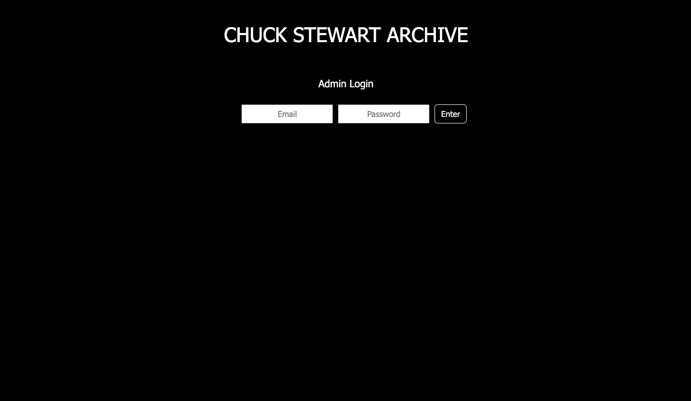
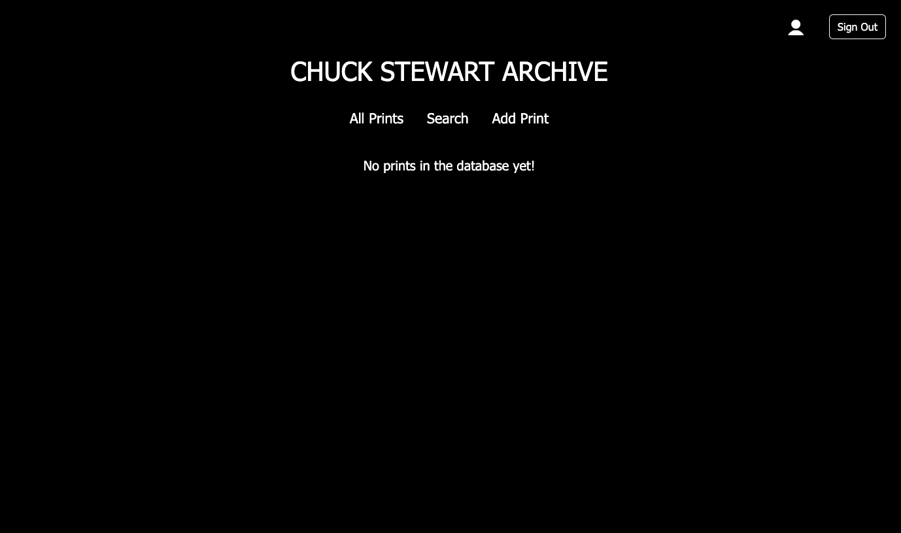
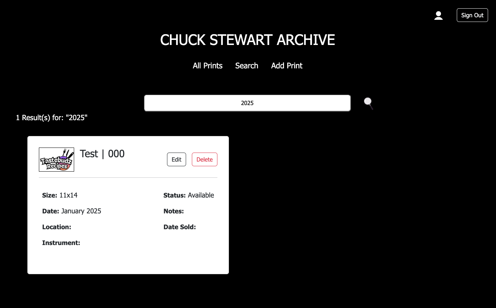
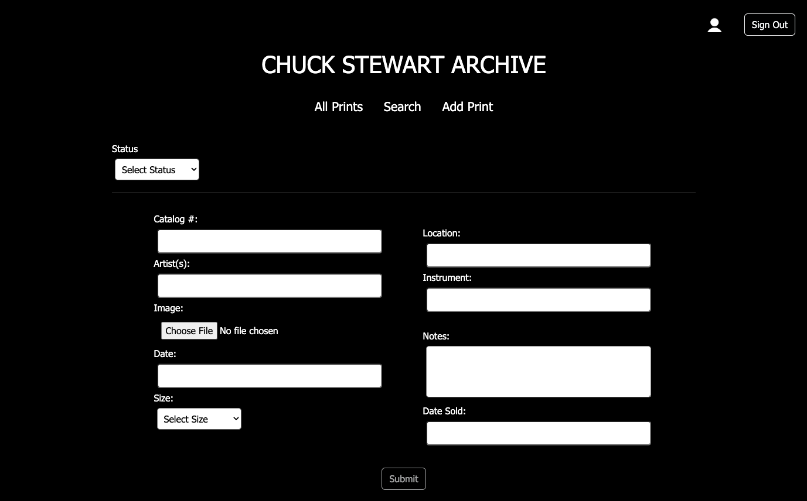
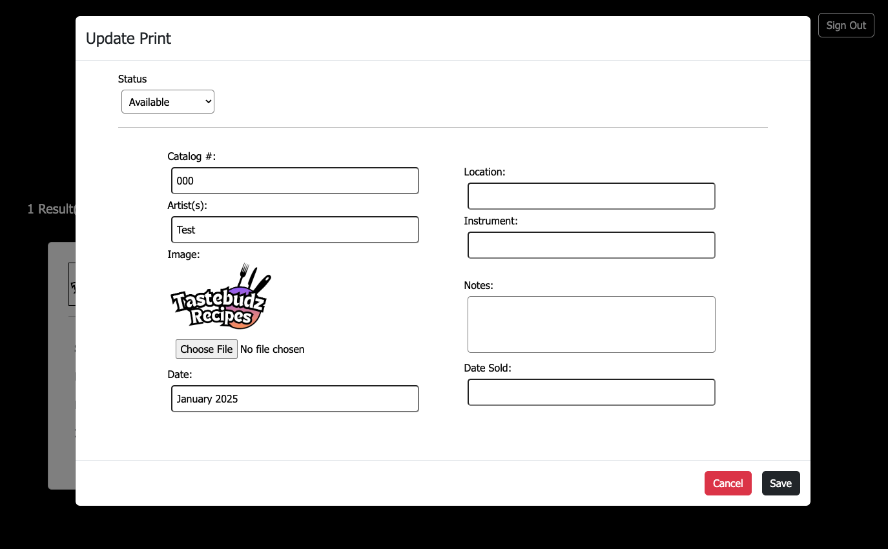
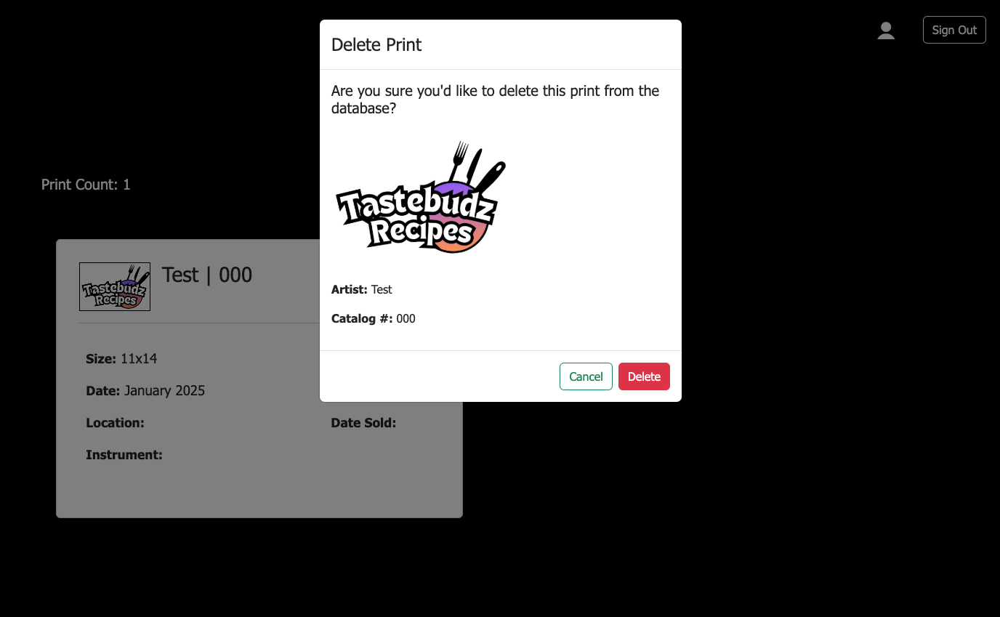

# chuck-stewart-archive
This application is a digital archive for managing and viewing prints. Admins can log in to access the archive, search for specific prints, add new prints, update existing ones, and delete prints as needed. 

## Tech Stack

## 
### Login

### All Prints

### Search

### Add Print

### Update Print

### Delete Print

