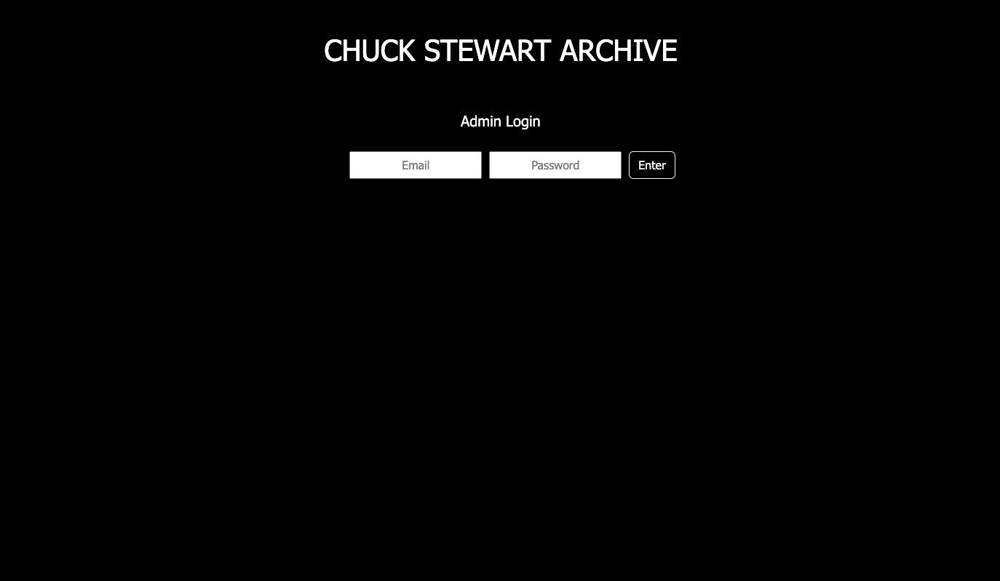
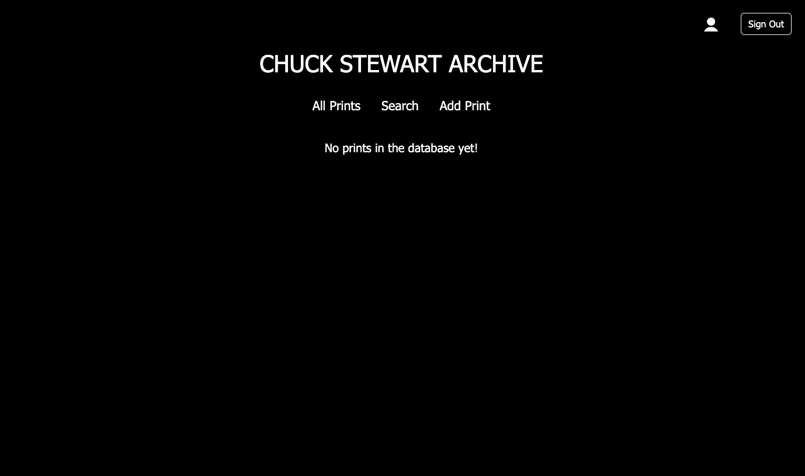
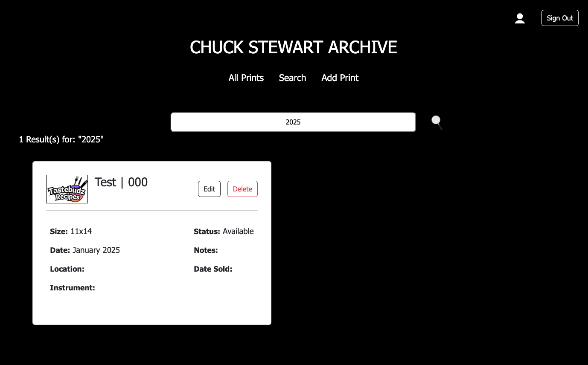
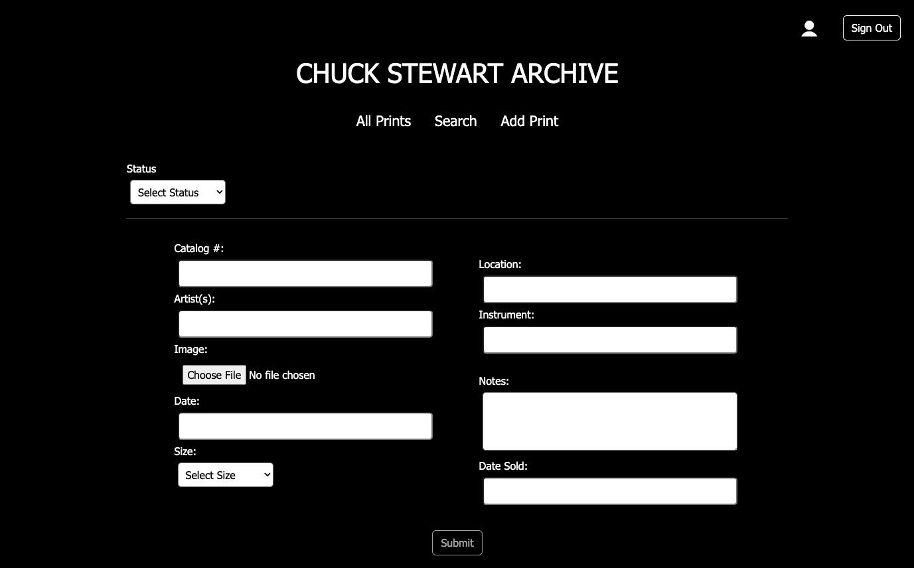
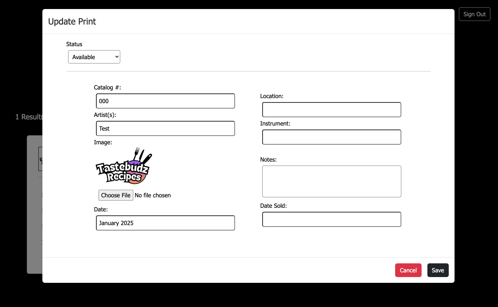
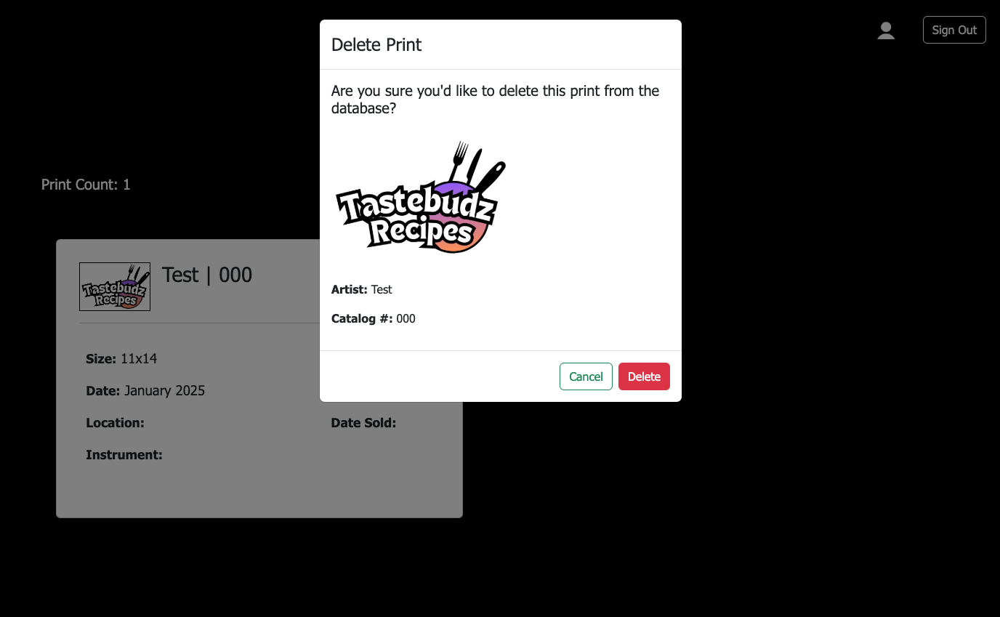

# Chuck Stewart Archive

A full-stack archive for Chuck Stewart photography prints. Authenticated admins can:

- view and filter the full archive
- search prints by catalog and metadata
- add, update, and delete print records
- bulk import print data and assets
- upload certificates, including Word files that auto-convert to PDF

## Tech Stack

[](https://skillicons.dev)

- Frontend: React + Vite
- Backend: Node.js + Express
- Database: SQLite (Sequelize)
- Storage: Azure Blob Storage
- Auth: JWT Bearer tokens
- File conversion service: Python Flask + docx2pdf

## Project Structure

```text
.
|- public/                # frontend app + Playwright e2e tests
|- server/                # backend routes/models/utils/tests
|- deploy.sh              # unified dev/test/build/deploy workflow
|- server.js              # API entrypoint
```

## Prerequisites

- Node.js 20+
- npm 10+
- Python 3.10+
- On Windows, Microsoft Word is required by docx2pdf for .doc/.docx conversion
- Azure Storage account and credentials

## Environment Variables

Create a `.env` file in the project root.

Required:

- `AZURE_STORAGE_CONNECTION_STRING`
- `AZURE_STORAGE_ACCOUNT_NAME`
- `AZURE_STORAGE_ACCOUNT_KEY`

Recommended:

- `JWT_SECRET` (strong, unique value)
- `JWT_EXPIRES_IN` (default: `8h`)
- `CERTIFICATE_CONVERTER_URL` (default: `http://127.0.0.1:5001`)
- `CLIENT_ORIGIN` (default: `http://localhost:5173`)

## Quick Start (Recommended)

Install dependencies:

```bash
npm install
```

Then run the full app stack (API + frontend + converter):

```bash
bash deploy.sh fullstack dev
```

This script:

- checks required ports before startup
- installs Python converter dependencies from `server/requirements.txt`
- starts:
  - API on `http://localhost:8000`
  - frontend on `http://localhost:5173`
  - converter on `http://127.0.0.1:5001`

## Manual Local Run (Alternative)

In separate terminals:

1. Start backend API

```bash
npm run server
```

2. Start frontend

```bash
npm run client
```

3. Start converter

```bash
python server/utils/file-converter.py
```

## Certificate Conversion (Bulk + Update)

The app supports certificate uploads as:

- `.pdf`
- `.doc`
- `.docx`

When a Word certificate is uploaded, the backend sends it to the Python converter and stores the resulting PDF in Azure Blob Storage.

Supported flows:

- Bulk certificate import
- Single certificate add/replace in Update Print form

## Scripts

```bash
# backend tests
npm run test:server

# frontend e2e tests
npm run test:e2e

# interactive e2e runner
npm run test:e2e:ui

# frontend build
npm run build
```

## Deploy Script Commands

```bash
# start all services in dev mode
bash deploy.sh fullstack dev

# run backend tests + frontend e2e tests
bash deploy.sh fullstack test

# run lint checks
bash deploy.sh fullstack lint

# production-style deploy workflow
bash deploy.sh fullstack deploy
```

Scope options:

- `fullstack`
- `frontend`
- `backend`

Action options:

- `dev`
- `test`
- `lint`
- `build`
- `deploy`

## Testing Coverage Highlights

- backend route tests (auth, prints, search, bulk upload)
- converter helper tests for Word-to-PDF and error handling
- Playwright e2e coverage for auth, prints, profile, and bulk upload
- e2e regression checks for Update Print certificate payload behavior

## Troubleshooting

### Prints do not appear on first load

Use `deploy.sh fullstack dev` so services start together. The frontend now retries initial print loading while API startup completes.

### Port already in use

If startup fails, free these ports first:

- `8000` API
- `5173` frontend
- `5001` converter

### Converter errors

Confirm:

- Python environment is available
- `server/requirements.txt` is installed
- converter is reachable at `CERTIFICATE_CONVERTER_URL`
- on Windows, Microsoft Word is installed for docx2pdf

## Screens

### Login



### All Prints



### Search



### Add Print



### Update Print



### Delete Print


